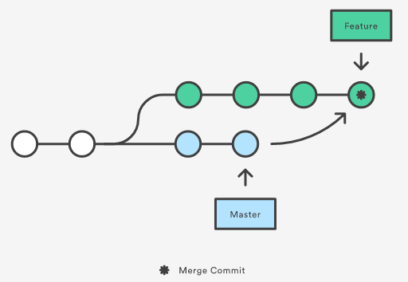

# Rebase - Merge
---
## Đặt vấn đề
Trong Git, có hai cách chính để tích hợp các thay đổi từ nhánh này vào nhánh khác:
- merge
- rebase

Giả sử, ta bắt đầu checkout một topic branch có tên là `feature` để xây dựng chức năng mới cho hệ thống, trong khi đó một thành viên khác của team đã cập nhật thêm những commit mới vào `integration branch`. Để đơn giản, chúng ta sẽ lấy luôn nhánh master làm integration branch.


Tình huống đặt ra là những commit mới ở nhánh master thì có liên quan đến chức năng mà nhóm đang thực hiện. Để tích hợp những commit đó vào nhánh feature, ta có thể thực hiện theo 2 cách: merge hoặc rebase.

## Merge
Phương pháp đơn giản:
```shell
git checkout feature
git merge master
```
> Merge nhánh master vào nhánh đang làm việc

Gộp 2 câu lệnh làm 1:
```
git merge master feature
```



Sau khi thực hiện, một `commit merge` mới sẽ xuất hiện ở lịch sử commit của nhánh `feature`, giống như một mối nối để ghép lại lịch sử của cả 2 nhánh:


## Rebase
Phương pháp:
```shell
git checkout feature
git rebase master
```
> Tích hợp thay đổi nhánh `master` vào nhánh `feature`

Thao tác này sẽ đưa toàn bộ những commit mới tạo ở nhánh `feature` nối tiếp vào "ngọn" của nhánh `master`, nhưng thay vì sử dụng một commit merge, nó sẽ __viết lại lịch sử của project bằng cách tạo ra những commit mới ứng với mỗi commit ban đầu của nhánh feature__


Lợi ích chính của việc rebase là có lịch sử commit rõ ràng, dễ theo dõi hơn. Đầu tiên, nó sẽ giúp loại bỏ những commit không cần thiết như khi sử dụng git merge. `rebase` giúp tạo ra lịch sử commit có dạng tuyến tính, xuyên suốt project từ khi bắt đầu cho đến hiện tại. Khi đó chúng ta sẽ dễ dàng điều hướng, kiểm tra lịch sử project với những câu lệnh như git log, git bisect.
