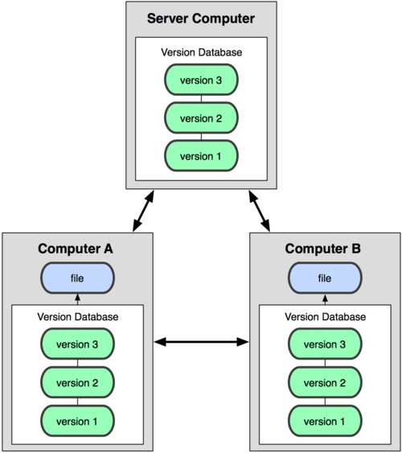

# Tổng quan GIT
---
## Cơ bản về GIT
Git là tên gọi của một Hệ thống quản lý phiên bản phân tán (Distributed Version Control System – DVCS) là một trong những hệ thống quản lý phiên bản phân tán phổ biến nhất hiện nay.

DVCS nghĩa là hệ thống giúp mỗi máy tính có thể lưu trữ nhiều phiên bản khác nhau của một mã nguồn được nhân bản (clone) từ một kho chứa mã nguồn (repository), mỗi thay đổi vào mã nguồn trên máy tính sẽ có thể ủy thác (commit) rồi đưa lên máy chủ nơi đặt kho chứa chính. Và một máy tính khác (nếu họ có quyền truy cập) cũng có thể clone lại mã nguồn từ kho chứa hoặc clone lại một tập hợp các thay đổi mới nhất trên máy tính kia. Trong Git, thư mục làm việc trên máy tính gọi là Working Tree.

Để lưu trữ phiên bản, Git sẽ tạo ra một “ảnh chụp” (snapshot) trên mỗi tập tin và thư mục sau khi commit, từ đó nó có thể cho phép tái sử dụng lại một ảnh chụp nào đó mà đã chỉ định là một phiên bản. Đây cũng chính là lợi thế của Git so với các DVCS khác khi nó không “lưu cứng” dữ liệu mà sẽ lưu với dạng snapshot.

## Các tính chất chính của GIT
- Git dễ sử dụng, an toàn và nhanh chóng.
- Có thể giúp quy trình làm việc code theo nhóm đơn giản hơn rất nhiều bằng việc kết hợp các phân nhánh (branch).
- Có thể làm việc ở bất cứ đâu vì chỉ cần clone mã nguồn từ kho chứa hoặc clone một phiên bản thay đổi nào đó từ kho chứa, hoặc một nhánh nào đó từ kho chứa.
- Dễ dàng trong việc deployment sản phẩm.
